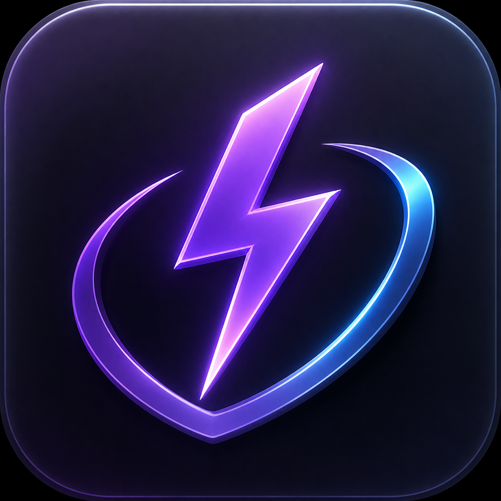

# CodexAwake

<p align="center">
  
</p>

CodexAwake is a native macOS menu bar utility and Codex cockpit. It launches its own local Codex App Server, provides a streamed chat UI for Codex, prevents **idle system sleep**, and offers an explicit opt-in **Closed-Lid** mode backed by a narrow privileged helper.

It uses the official App Server protocol for managed-task state. For independent Codex Desktop tasks, it reads only local rollout identity plus `task_started` / `task_complete` lifecycle markers; prompt and response text is never decoded. The desktop bundle identifier remains the ON/OFF presence signal. CodexAwake owns at most one `PreventUserIdleDisplaySleep` assertion, which keeps both the display and the system awake while protection is active. Closed-Lid is separate, defaults off, and changes the system sleep policy only while a short renewable lease is active.

> [!IMPORTANT]
> CodexAwake tracks its own cockpit tasks and Codex CLI/TUI sessions connected with `--remote` to the App Server launched by CodexAwake. It separately detects active root tasks created by Codex Desktop from lifecycle markers in `~/.codex/sessions`; those sessions are identified as Desktop tasks but their prompts, responses, reasoning, and tool output are not read. Ordinary unmanaged CLI sessions, Codex Cloud, another user's processes, and remote hosts remain out of scope unless they connect to the managed server.

## Install and run / Установка и запуск

### English

You need:

- macOS 14 or newer;
- Xcode installed and opened at least once;
- access to this private GitHub repository;
- ChatGPT/Codex Desktop signed in, or a compatible standalone Codex CLI.

1. Open Terminal and run:

   ```bash
   git clone https://github.com/Melnk/codex-awake.git
   cd codex-awake
   scripts/build_app.sh
   ```

2. Start CodexAwake:

   ```bash
   open dist/CodexAwake.app
   ```

3. The dashboard opens automatically. While CodexAwake is running, its icon stays in the Dock and macOS shows the normal running-app indicator below it. If you close the dashboard, click the Dock icon or the **bolt icon** in the macOS menu bar and select **Open Cockpit…**.

4. Choose a project folder in **Chat with Codex**. The main protection switch is enabled by default and starts protecting the Mac when Codex is open or a tracked task is active.

   Use the **EN / RU** switch in the top-right corner to change the application language. The choice is saved for the next launch.

5. Optional: to keep the Mac running with the lid closed, enable **Closed-lid mode**, click **Enable closed-lid mode**, and approve the one-time administrator prompt. Close the lid only after the status says **Active — you can close the lid**.

To keep the app in Applications, open the build folder and drag **CodexAwake.app** into **Applications**:

```bash
open dist
```

Then start it with Finder or:

```bash
open /Applications/CodexAwake.app
```

If macOS blocks the first launch, right-click **CodexAwake.app**, choose **Open**, and confirm **Open** again.

### Русский

Что потребуется:

- macOS 14 или новее;
- установленный Xcode, который был запущен хотя бы один раз;
- доступ к этому приватному GitHub-репозиторию;
- выполненный вход в ChatGPT/Codex Desktop или совместимый отдельный Codex CLI.

1. Откройте Терминал и выполните:

   ```bash
   git clone https://github.com/Melnk/codex-awake.git
   cd codex-awake
   scripts/build_app.sh
   ```

2. Запустите CodexAwake:

   ```bash
   open dist/CodexAwake.app
   ```

3. Главное окно откроется автоматически. Пока CodexAwake запущен, его иконка остаётся в Dock, а macOS показывает под ней стандартную точку работающего приложения. Если вы закрыли окно, нажмите на иконку в Dock или на **иконку молнии** в строке меню macOS и выберите **Open Cockpit…**.

4. В блоке **Chat with Codex** выберите папку проекта. Основная защита включена по умолчанию и не даёт Mac уснуть, когда открыт Codex или выполняется отслеживаемая задача.

   Переключатель **EN / RU** в правом верхнем углу меняет язык приложения. Выбранный язык сохраняется для следующих запусков.

5. Необязательно: чтобы Mac продолжал работать с закрытой крышкой, включите **Closed-lid mode**, нажмите **Enable closed-lid mode** и один раз подтвердите запрос администратора. Закрывайте крышку только после появления статуса **Active — you can close the lid**.

Чтобы перенести приложение в «Программы», откройте папку сборки и перетащите **CodexAwake.app** в **Applications**:

```bash
open dist
```

После этого запускайте его через Finder или командой:

```bash
open /Applications/CodexAwake.app
```

Если macOS блокирует первый запуск, нажмите на **CodexAwake.app** правой кнопкой мыши, выберите **Открыть**, а затем ещё раз подтвердите запуск.

## Cockpit

Open **Open Cockpit…** from the menu bar. The native SwiftUI dashboard uses a clean violet visual language with a saved **Light / Dark** appearance switch. It includes:

- a clear **ON/OFF** protection card that explains what is currently keeping the Mac awake;
- a saved **EN / RU** language switch for the cockpit, menu, dialogs, and diagnostics;
- Codex Desktop presence, assertion, and combined active-session instruments;
- privacy-safe IDs for active Codex Desktop and managed tasks;
- a plain-language **Closed-lid mode** status, toggle, and one-time setup action;
- a project picker and streamed Codex conversation;
- **New task**, **Stop**, Enter-to-send, Shift-Enter newline, and arrow-button controls;
- approval cards for shell commands, network access, and file changes.

The cockpit uses the authenticated [Codex App Server](https://learn.chatgpt.com/docs/app-server), not a separately stored API key. Select a project folder before starting a task. Codex is given workspace-write access to that folder and uses the installed runtime's `on-request` approval policy; approval prompts remain visible while the task is active.

## How it works

```text
Cockpit / connected CLI ─→ managed App Server events ───────────────┐
Codex Desktop rollouts ──→ task_started / task_complete markers ────┼─→ combined active sessions
Codex Desktop bundle ID ─→ ON/OFF presence ─────────────────────────┘              ↓
                                                               PowerProtectionManager
                                                                  ↙             ↘
                                                ONE idle-sleep assertion     optional XPC lease
                                                                                      ↓
                                                                      root helper → pmset disablesleep
```

The runtime status returned by `thread/read` is the source of truth. Notifications (`turn/started`, `turn/completed`, `thread/status/changed`, and `thread/closed`) reduce latency; `thread/loaded/list` plus `thread/read` reconcile state at connection, reconnection, and every 10 seconds.

## Tracked and untracked activity

Tracked:

- tasks started in the CodexAwake cockpit;
- Codex CLI/TUI clients launched with the menu's **Open Codex** action;
- clients started manually with the command from **Copy Codex command**;
- multiple clients connected to the same CodexAwake-managed endpoint;
- active statuses including `waitingOnApproval`;
- whether ChatGPT/Codex Desktop is currently running;
- active top-level Codex Desktop tasks whose rollout metadata says `source = vscode` and `originator = Codex Desktop`.

Not tracked:

- `codex` started without `--remote`;
- Codex Desktop prompts, responses, reasoning, tool output, titles, and subagent rollouts;
- Codex Cloud jobs;
- other users' processes;
- unrelated App Server processes;
- remote machines not using the displayed endpoint.

The first-run menu, cockpit, and Diagnostics window repeat this boundary. Desktop presence is shown as `CODEX APP ON/OFF`; detected lifecycle activity is shown separately inside `ACTIVE SESSIONS`. With the presence toggle off, a detected active Desktop task still protects idle sleep. With the toggle on, the running Desktop app protects idle sleep even between tasks.

## Requirements

- macOS 14 or later;
- Apple silicon or Intel Mac;
- full Xcode for source builds (tested with Xcode 26.6 / Swift 6.3.3);
- ChatGPT/Codex Desktop with a compatible bundled runtime, or a standalone Codex CLI whose help advertises both `codex --remote` and `codex app-server --listen unix://`.

No third-party packages are used. The application uses SwiftUI, Foundation, Swift Concurrency, OSLog, ServiceManagement, AppKit, CryptoKit, Darwin Unix sockets, XPC, and IOKit.

## Build details

The bilingual quick start above is the recommended installation path. From an existing repository checkout, run the full test suite and create a release bundle with:

```bash
scripts/test.sh
scripts/build_app.sh
```

The release build is assembled as `dist/CodexAwake.app` and ad-hoc signed for local development. It includes the separately signed Closed-Lid helper plus narrow install/uninstall scripts. Copy it to `/Applications` if desired. A paid Apple Developer account is not required for local use, but installing the helper requires one administrator approval.

To build a debug bundle:

```bash
CONFIGURATION=debug scripts/build_app.sh
```

`Package.swift` can be opened directly in Xcode. The scripts redirect Swift/Clang caches to ignored `.build/` paths and use `--disable-sandbox` because some managed development environments prohibit SwiftPM's nested `sandbox-exec`.

## First launch

CodexAwake uses the normal macOS Dock lifecycle (`LSUIElement=false`), so the Dock shows its icon and running-app indicator while the process is active. The cockpit opens automatically at launch; after closing it, reopen it from the Dock icon, the bolt menu with **Open Cockpit…**, or launch the `.app` again. On first launch the menu shows these facts:

1. cockpit tasks and sessions connected to its managed `--remote` endpoint are tracked individually;
2. Codex Desktop process presence and top-level task lifecycle are detected, while chat contents remain private;
3. idle sleep protection is unprivileged; Closed-Lid is a separate opt-in feature that requires an administrator-approved helper and automatically expires.

CodexAwake first tries the runtime bundled inside an installed ChatGPT/Codex app. If no compatible runtime can be found, the menu shows `Codex: Not found` and App Server state `Failed`; open **Diagnostics… → Choose Codex Binary…** to select an executable.

## Codex binary discovery

The locator checks, in order:

1. a user-selected path saved in `UserDefaults`;
2. the runtime bundled in `/Applications/ChatGPT.app` or `/Applications/Codex.app`, including per-user Applications equivalents;
3. `command -v codex` in a login zsh;
4. `/opt/homebrew/bin/codex`;
5. `/usr/local/bin/codex`;
6. `~/.local/bin/codex` and `~/.codex/bin/codex`.

It runs read-only `--version` and help probes. It does not modify shell startup files or global Codex configuration.

## Managed App Server and transport

CodexAwake launches exactly one owned child process with the current equivalent of:

```bash
codex app-server --listen unix:///private/runtime/path/app-server.sock
```

The endpoint is a WebSocket HTTP Upgrade over a Unix domain socket, as specified by the [official Codex App Server documentation](https://learn.chatgpt.com/docs/app-server). The runtime directory is short, per-user, mode `0700`, and outside the repository. CodexAwake removes a stale socket only when it is an owned Unix socket that does not accept connections. It refuses active, foreign-owned, or non-socket paths.

No TCP port is opened. The CodexAwake process makes no external network connection; it communicates locally with the Codex child. The Codex App Server itself performs the normal Codex service communication needed by connected CLI sessions.

## Launch Codex through CodexAwake

Use either menu command:

- **Open Codex** writes a credential-free `.command` helper in the user's Application Support directory with mode `0700`, then opens it in Terminal;
- **Copy Codex command** copies the exact local command, conceptually:

  ```bash
  codex --remote unix:///private/runtime/path/app-server.sock
  ```

The command contains no capability token or credential. The endpoint changes only if the runtime path changes. Do not launch plain `codex` if you expect CodexAwake to track that session.

## Auto Keep Awake

**Auto Keep Awake** defaults to on. With it enabled:

- if **Keep awake while Codex App is running** is enabled, Codex Desktop presence acquires the assertion even when no managed task is visible;
- while the assertion is held, macOS does not automatically dim or turn off the display and cannot enter idle system sleep;
- an active Codex Desktop lifecycle acquires the assertion even when full-time presence protection is disabled;
- `0 → 1+` active managed threads acquires one assertion;
- additional active threads reuse that assertion;
- desktop exit or `1+ → 0` managed threads releases after a one-second debounce when no other source still requires protection;
- `waitingOnApproval` remains active;
- `idle`, `notLoaded`, and `systemError` are inactive.

The main protection switch overrides every source and releases immediately when switched off. The separate desktop-presence toggle leaves precise managed-task and detected Desktop-task protection enabled. CodexAwake does not expose a default-on manual or indefinite force-awake mode.

## Closed-Lid mode

The display-sleep assertion still allows sleep when a MacBook lid is closed. Closed-Lid therefore uses a separate root helper instead of pretending that the ordinary assertion can do more than the platform promises.

1. Build and launch CodexAwake 1.3 or later.
2. In the cockpit, turn on **Closed-lid mode**.
3. Click **Enable closed-lid mode** and complete the one-time administrator prompt.
4. Wait until the cockpit says **Active — you can close the lid** before closing the display.

The helper accepts only `status`, `acquire`, `renew`, and `release` over its fixed XPC interface. The installed launch daemon authorizes the exact CDHash of the app that installed it. Ad-hoc rebuilding changes that hash, so local development builds must use **Install / Update Helper** again.

While ordinary sleep protection is required, CodexAwake acquires a 120-second lease and renews it every 30 seconds. The root helper snapshots the prior `disablesleep` value, applies `pmset -a disablesleep 1`, persists only token expirations and the restoration value under `/var/db/com.melnikoleg.CodexAwake`, and restores the prior value after the final release, app shutdown, helper shutdown, or lease expiry. A client crash can therefore leave the setting changed for no more than the remaining bounded lease.

Closed-Lid keeps the computer awake as a whole, not only Codex. Music, downloads, servers, and other processes can continue; the internal display is physically unavailable. Battery drain and heat will be higher, and macOS may still force sleep for low battery, thermal protection, shutdown, or other safety conditions. The feature defaults off. Use **Diagnostics → Remove Closed-Lid Helper** to restore normal behavior and remove the daemon.

## Reconnect and fail-safe policy

If the observer connection drops while managed work may be active, state becomes **Activity unknown / reconnecting**. The assertion is retained for at most 30 seconds while the client reconnects and reconciles. A confirmed App Server exit clears managed-task protection; desktop-presence protection remains if enabled and Codex Desktop is still running. If neither source can be confirmed, CodexAwake releases rather than keeping the Mac awake forever.

The supervisor distinguishes requested stop from crash, drains child stdout/stderr without logging their contents, reaps the child, and restarts unexpected exits with capped exponential backoff. It never searches for or kills unrelated Codex processes.

## Launch at Login

The menu's **Launch at Login** toggle uses `SMAppService.mainApp`. CodexAwake does not create a manual LaunchAgent and does not edit `.zshrc`, `.bashrc`, or other shell files.

## Diagnostics

**Diagnostics…** shows and copies:

- app, macOS, architecture, Codex path/version;
- transport and local endpoint;
- App Server state, owned PID, and start time;
- loaded/active counts and abbreviated thread/turn IDs;
- active Codex Desktop lifecycle count and abbreviated session IDs;
- assertion state, last event/reconciliation, reconnect count;
- Closed-Lid requested/installed/reachable/lease state, expiry, and sanitized helper error;
- the latest sanitized operational error.

It excludes prompts, model responses, diffs, tool output, terminal output, file contents, tokens, credentials, cookies, auth files, and complete environment variables. The Desktop scanner decodes only the first `session_meta` record and searches backwards for the latest exact lifecycle marker; it does not decode message records. Cockpit messages are held in the current UI session and sent to the managed Codex server, but are never copied into Diagnostics or OSLog. Codex persists normal conversation history according to its own configuration. There is no CodexAwake telemetry.

## Verify the assertion

1. Launch CodexAwake and confirm `App Server: Running` and the expected `Codex Desktop` presence state.
2. Use **Copy Codex command** and run it in a terminal.
3. Start a safe test turn (this is the only step that can consume model quota).
4. Confirm the menu shows an active thread and `Keep Awake: ON`.
5. Inspect system assertions without changing settings:

   ```bash
   pmset -g assertions
   ```

6. Wait for the final turn to complete and the one-second debounce. Confirm `Keep Awake: OFF`.
7. Repeat with multiple TUI clients; CodexAwake should still own only one assertion.

The unprivileged app never runs `pmset`. Only the installed root helper invokes the exact fixed `disablesleep` commands while a bounded lease exists.

## Closed-lid limitations

Without the optional helper, CodexAwake prevents **idle system sleep** only and closing a MacBook lid still sleeps the machine. With a confirmed active Closed-Lid lease, the helper temporarily requests `disablesleep`; this is a system-wide power-policy change rather than a per-process suspension exception. It cannot override low-battery, thermal, shutdown, or hardware safety behavior and is not presented as an unconditional macOS guarantee.

## Built-in Codex prevent-idle feature

Some Codex versions may expose their own experimental prevent-idle-sleep feature. CodexAwake never edits `~/.codex/config.toml` or toggles Codex feature flags. If the user enables both mechanisms, Codex may own another assertion. The guarantee here is that **CodexAwake owns at most one of its own assertions**, not that only one assertion exists system-wide.

## Privacy and security

- Unix socket runtime directory: `0700`;
- no listening TCP interface;
- no credentials in arguments, clipboard, logs, or helper script;
- privileged helper accepts only four fixed lease/status methods and authenticates the installing app's exact code hash;
- helper state contains no prompt, credential, workspace, or response data and expires automatically;
- no prompt, response, diff, tool, terminal, or file-content logging (cockpit text exists only in UI memory and normal Codex conversation storage);
- read-only Desktop rollout scanning limited to identity and lifecycle markers;
- no telemetry or CodexAwake outbound network client;
- only the exact child process started by CodexAwake is terminated;
- OSLog contains lifecycle/state/counts and sanitized errors only.

## App Server compatibility

App Server is an evolving protocol. CodexAwake performs runtime capability checks instead of accepting a version number alone. The implementation uses stable non-experimental methods in the current official schema: `initialize`, `initialized`, `thread/loaded/list`, `thread/read`, and status/turn/thread notifications. It does not request `capabilities.experimentalApi`.

The ChatGPT-bundled Codex runtime `0.147.0-alpha.6.5` was discovered and used to validate a real local App Server launch and `initialize`/`initialized` handshake on 2026-08-11. No model prompt was sent during that check. Real multi-client notification fan-out still requires an explicit quota-consuming manual turn and is not claimed as verified. The fake-server suite validates the remaining wire/state logic. Run the read-only handshake after updating Codex:

```bash
scripts/real_app_server_test.sh
```

That script starts a temporary local server, performs `initialize`/`initialized` and read-only reconciliation, sends no model prompt, and consumes no model quota. See [app-server-compatibility.md](docs/app-server-compatibility.md).

## Development and tests

```bash
scripts/test.sh                 # unit + fake App Server integration suite
scripts/build_app.sh            # release .app + ad-hoc signing
scripts/verify.sh               # metadata, Dock lifecycle, signature, diff, secret-shaped files
scripts/real_app_server_test.sh # explicit, read-only real CLI handshake
```

The test suite wraps power management and the privileged helper client behind protocols; tests never create a real sleep assertion or change `pmset`. It includes mocked power and lease clients, fail-open idle assertion behavior, safe installer command quoting, process/client/timer behavior, a scripted transport, malformed payloads, disconnect/reconnect, request matching, stale socket policy, and 10+ concurrent thread scenarios.

## Troubleshooting

**Codex not found**

- Confirm ChatGPT/Codex is installed in `/Applications`, or:
- Run `command -v codex` and `codex --version` in a login shell.
- Choose the executable in Diagnostics.
- Confirm `codex --help` includes `--remote` and `codex app-server --help` includes Unix `--listen` syntax.

**App Server failed**

- Open Diagnostics and copy the sanitized error.
- Ensure no other process owns the displayed socket.
- Use **Restart App Server**. CodexAwake will not delete an active or foreign socket.

**Active turn is not detected**

- Confirm the TUI was started with the exact copied `--remote` command.
- Wait up to the 10-second reconciliation interval.
- For Codex Desktop, wait up to one second and confirm the task is a top-level Desktop task, not only a subagent.
- Confirm `~/.codex/sessions` is readable and the installed runtime still writes `task_started` / `task_complete` markers.
- Independent cloud and plain CLI activity is intentionally out of scope.

**Chat send fails**

- Confirm the header says `READY` and a project is selected.
- Enter sends, Shift-Enter inserts a newline, and the arrow button uses the same action.
- If the server is not ready, the composer preserves the draft and shows the exact readiness reason instead of silently doing nothing.

**Assertion seems duplicated**

- `pmset -g assertions` can show assertions from Codex itself and other apps.
- Disable any separately enabled experimental Codex prevent-idle feature if you want only CodexAwake's assertion.

**Closed-Lid says Helper Required or Helper Needs Update**

- Click **Install / Update Helper** and complete the administrator prompt in Terminal.
- Reinstall after every ad-hoc rebuild because the authorized app CDHash changes.
- Do not close the lid until the cockpit explicitly says **LEASE ACTIVE · LID MAY CLOSE**.
- Check the sanitized helper error in Diagnostics. If removal is needed, use **Remove Closed-Lid Helper** and complete its administrator prompt.

## Architecture and release workflow

See [architecture.md](docs/architecture.md) and [architecture decisions](docs/decisions/README.md). For future Developer ID signing, hardened runtime, notarization, and releases, see [release.md](docs/release.md).

Recommended GitHub workflow:

1. create a `codex/<topic>` branch;
2. implement and run `scripts/test.sh`;
3. run `scripts/build_app.sh` and `scripts/verify.sh`;
4. review `git diff`, staged changes, and secret-shaped files;
5. push and open a private pull request;
6. add Developer ID signing/notarization only in a credential-protected release workflow.
